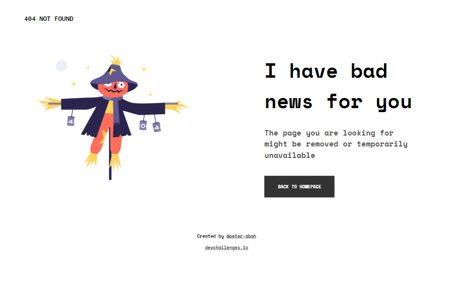

# 404 Page
Solution for a challenge from  [Devchallenges.io](httpS://devchallenges.io)

[DEMO](https://peter-abah.github.io/404-page) | [SOLUTION](https://devchallenges.io/solutions/xA5sHfPDB9ZZTQAj6h6g) | [CHALLENGE](https://devchallenges.io/challenges/wBunSb7FPrIepJZAg0sY)

## Table of Contents

- [Overview](#overview)
  - [Built With](#built-with)
- [Contact](#contact)
- [Acknowledgements](#acknowledgements)

## Overview

The challenge was to replicate the [design](https://devchallenges.io/challenges/wBunSb7FPrIepJZAg0sY) as close as possible.
Although the challenge was relatively easy, I used it to learn:
- How to organise my scss files in folders.
- I also tried using PostCSS and the plugins tp get a good feel of them later.
- Learning how to use PostCSS made me learn gulp. Now I can create basic gulp tasks.

### Built With

- HTML
- CSS
- SASS
- PostCSS
- Gulp

## Acknowledgements
- [Gulp Documentation](https://gulpjs.com/docs/en/getting-started/javascript-and-gulpfiles)
- [Smashing Magazine PostCSS article](https://www.smashingmagazine.com/2015/12/introduction-to-postcss/)

## Contact

- LinkedIn [Peter Abah](https://www.linkedin.com/in/peter-abah-321b73210)
- GitHub [@peter-abah](https://github.com/peter-abah)
- Twitter [@iamabah1](https://twitter.com/iamabah1)
